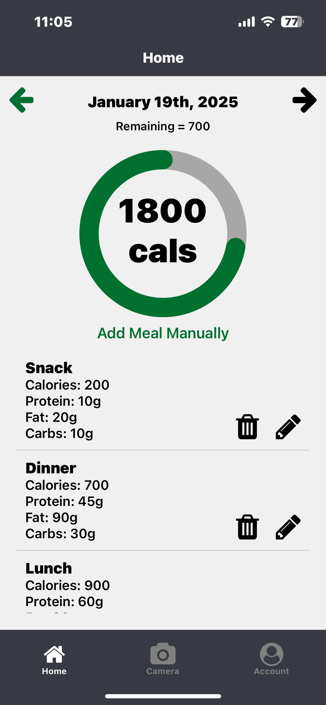

# Snap Nutrition

This is a Nutrition Tracker App built with Expo and React Native. Users can take photos of their meals and upload them to get nutritional information. The app allows users to track their daily meals, calories, and macronutrients. 

[Expo Build](https://expo.dev/preview/update?message=its%20perfect%0A-Fixed%20pick%20img%0A-switch%20days%0A-save%20data%20between%20runs%0A-edit%20and%20delete%0A-dummy%20data&updateRuntimeVersion=1.0.0&createdAt=2025-01-19T19%3A35%3A39.554Z&slug=exp&projectId=48e72d46-e522-4280-9d2f-c224e0219dae&group=36ebd70f-47ca-481d-bb7d-3a849a280bb8)



## Table of Contents

- [Snap Nutrition](#snap-nutrition)
  - [Table of Contents](#table-of-contents)
  - [Installation](#installation)
    - [Frontend:](#frontend)
    - [Server:](#server)
  - [Usage](#usage)
  - [Project Structure](#project-structure)
  - [API](#api)
  - [License](#license)

## Installation

Clone the repository:

   ```bash
   git clone https://github.com/yourusername/nutrition-tracker.git
   cd nutrition-tracker
   ```
### Frontend:
1. Install dependencies:

   ```bash
   npm install
   ```

2. Start the Expo development server:

   ```bash
   npx expo start
   ```

### Server:
1. Install dependencies:

   ```bash
   pip install -r requirements.txt
   ```

2. Start the server on port 5000:

   ```bash
   python3 app.py
   ```

## Usage
1. Make sure the url in frontend/app/global.js is pointed at the server and add an OpenAI API key to server/macros.py
2. Open the Expo Go app on your mobile device.
3. Scan the QR code displayed in the terminal or browser after running `npx expo start`.
4. The app should open on your device.

## Project Structure

```plaintext
frontend/
  app/
    (tabs)/
      _layout.tsx
      account.tsx
      camera.tsx
      index.tsx
      settings.tsx
    classes.js
    global.js
    test.json
  assets/
    fonts/
    images/
  .expo/
  .gitignore
  app.json
  package.json
  README.md
  tsconfig.json
server/
  app.py
  macros.py
  requirements.txt
  templates/
    index.html
README.md
```

## API

The server provides an endpoint for uploading meal images and getting nutritional information.

- `POST /success`: Upload a meal image and get nutritional information.

## License

This project is licensed under the MIT License.
